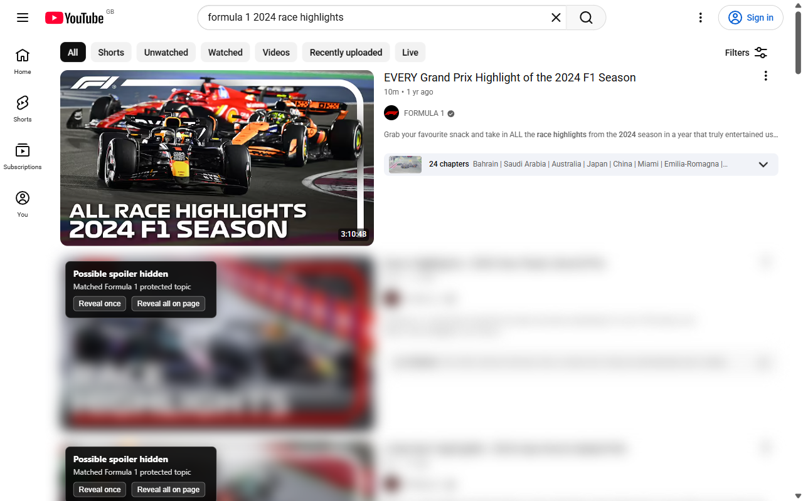
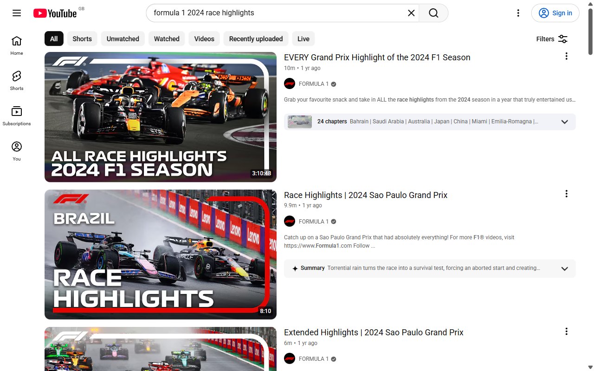
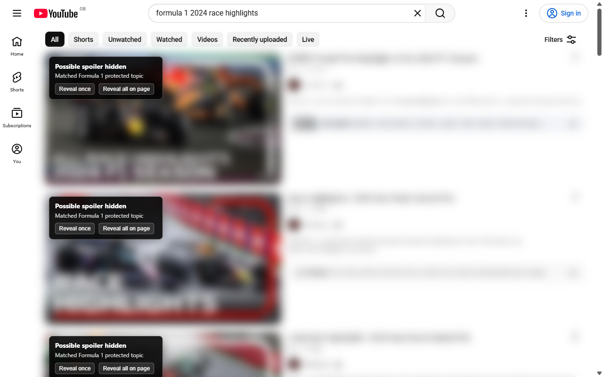
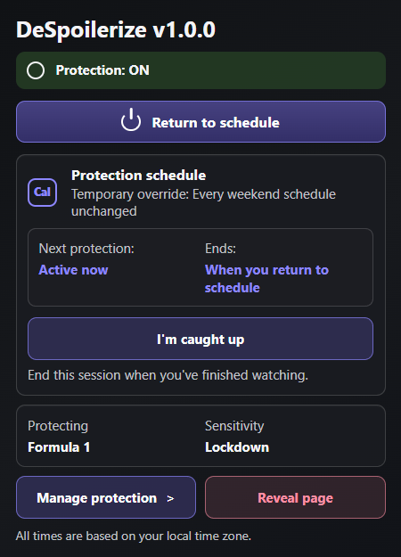
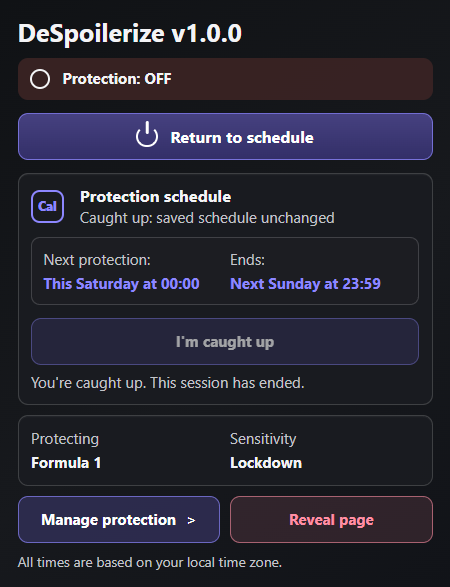
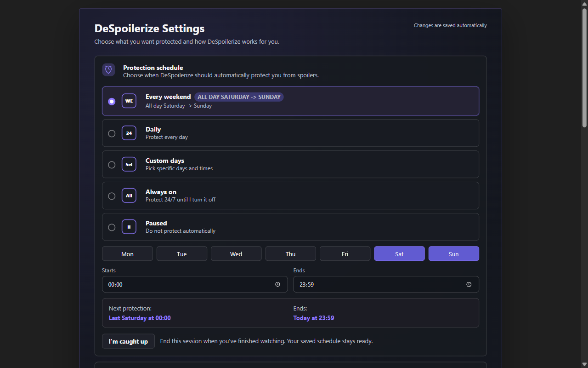
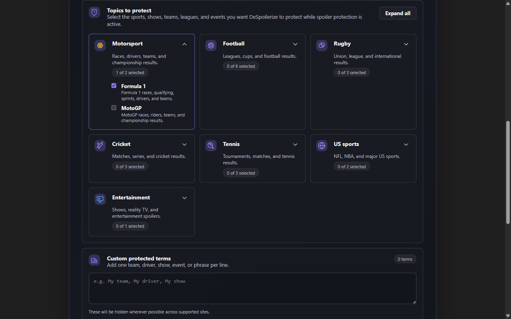

# DeSpoilerize in use

These images show DeSpoilerize v1.0.0 running in Chrome for Testing on 27 September 2026. YouTube was opened in a newly created, signed-out profile. No personal account, recommendations, cookies or browsing history were reused.

The source is a [public YouTube search for Formula 1 race highlights](https://www.youtube.com/results?search_query=formula+1+2024+race+highlights&sp=EgIQAQ%253D%253D). These are the site's actual results, photographs and layout. Search results can include newer videos even when the query names an earlier season.

## Reveal one, keep the rest protected

The first video's photograph and title are visible after selecting **Reveal once**. The next cards retain the extension's blur and reveal controls. Formula 1 protection uses **Lockdown**, which hides matching topics as well as explicit result wording.

## Protection off and on

The same page was captured without refreshing or rearranging the results.

**Protection off:** the original photographs, titles and descriptions are visible.

**Protection on:** DeSpoilerize hides the matching cards and supplies its real reveal controls. The YouTube navigation and search controls remain usable.

## Toolbar controls

These are captures of Chrome's actual extension popup at its native size. **I'm caught up** ends this session and shows the next scheduled start and end.

| Protection active | Caught up |
| --- | --- |
|  |  |

## Schedule and protected topics

The settings page is captured at normal page scale. Changes save automatically.

## Capture details

- Browser: Chrome for Testing 148.0.7778.96, Windows.
- Five store images: 1280 × 800 PNG page captures. Chrome's tab strip and address bar are outside these images; no imitation browser frame is added.
- Two additional popup images: direct captures of Chrome's toolbar-popup target, retained at native size for the documentation.
- Processing: no replacement text, photographs, thumbnails or blur, and no compositing. All hiding and revealing comes from the running extension.
- Verification: loaded thumbnails; visible **Sign in** control; protection off/on; one card revealed while another stays hidden; **I'm caught up** switches protection off.
- [Machine-readable capture record](./capture.json).

Run `npm run screenshots:store` from the repository root to rebuild and capture a new set. Each run creates a new temporary profile and closes its browser afterwards. The temporary profile is left for normal OS cleanup. Internet access is required, and results may differ over time. A consent prompt is dismissed using **Reject all** when present; the script never signs in or opens a personal profile.

For the Chrome Web Store, use the five numbered images in this directory; the smaller `details` images are for documentation. The earlier synthetic screenshots are retained in the parent directory as historical assets.
