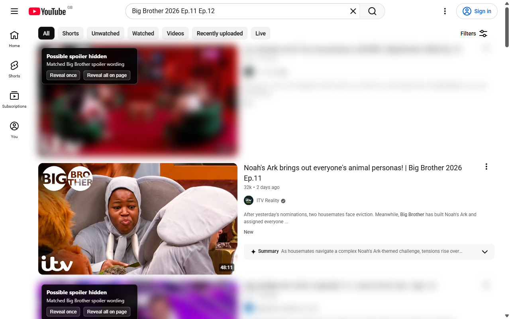
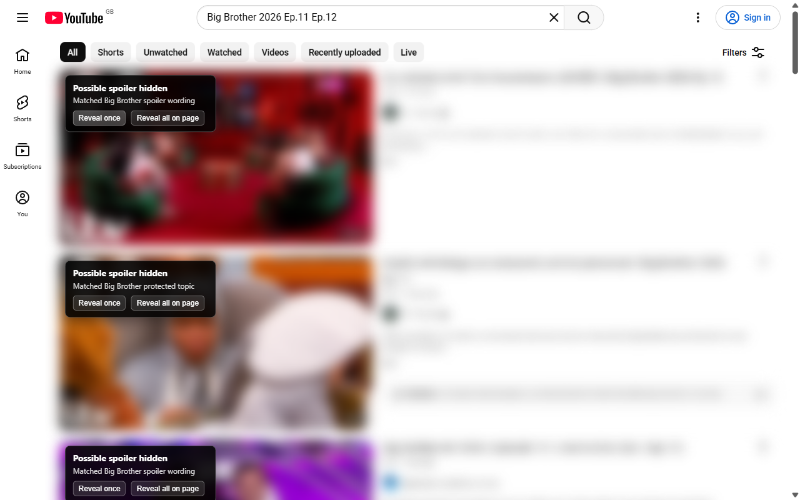
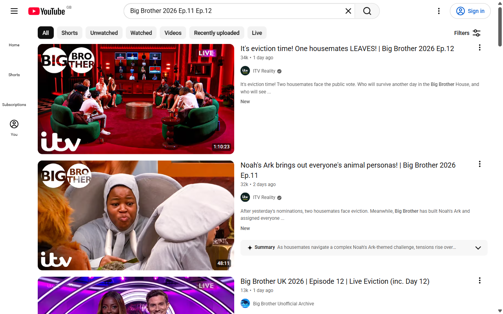
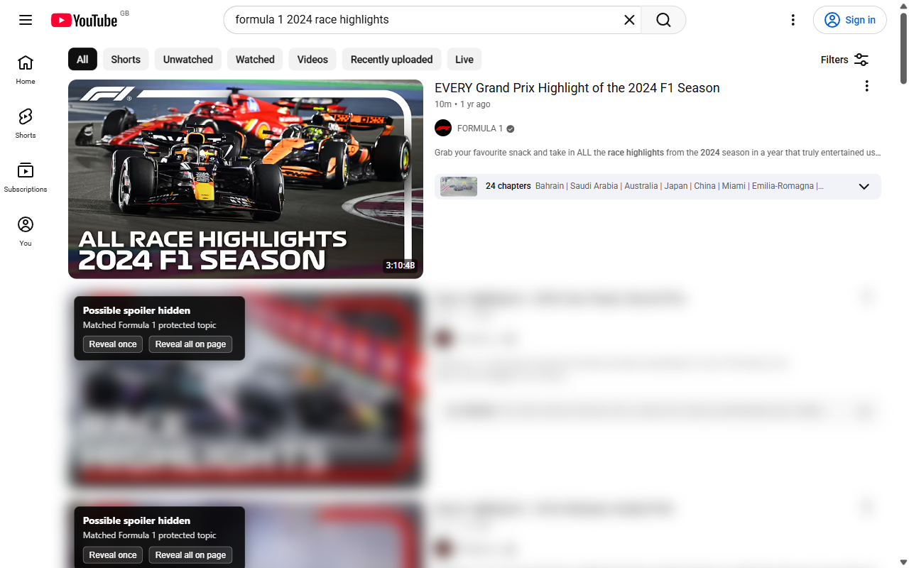
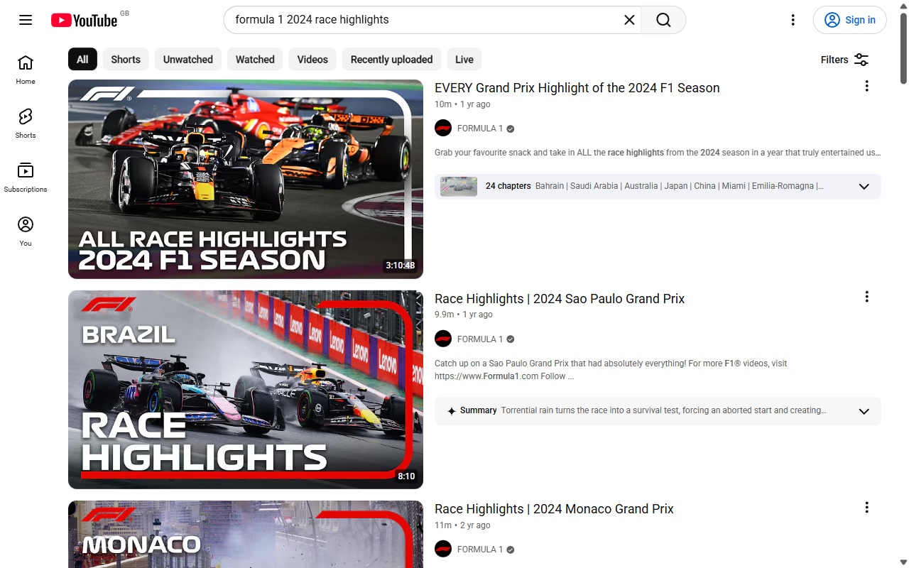
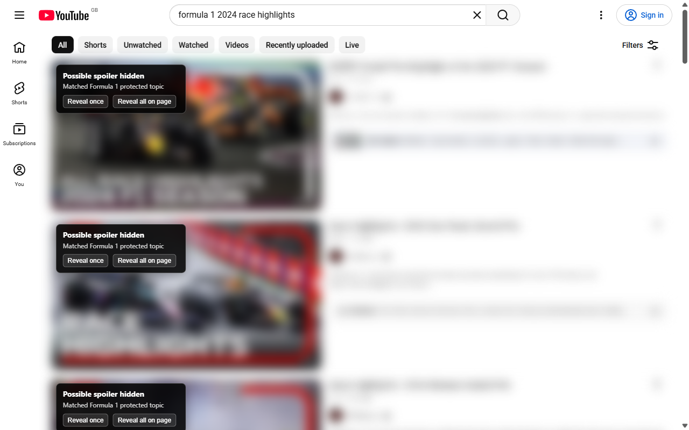
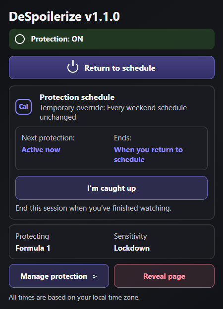
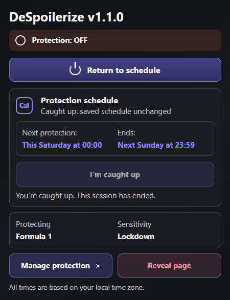
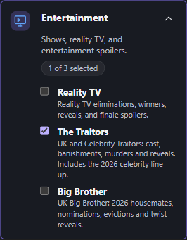
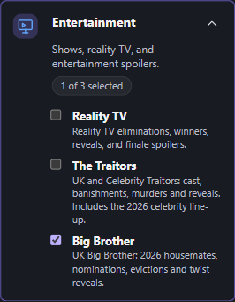

# DeSpoilerize in use

These images show DeSpoilerize v1.1.0 running in Chrome for Testing on 27 September 2026. YouTube was opened in a newly created, signed-out profile. No personal account, recommendations, cookies or browsing history were reused.

The sources are public YouTube searches for [Big Brother episodes 11 and 12](https://www.youtube.com/results?search_query=Big+Brother+2026+Ep.11+Ep.12&sp=EgIQAQ%253D%253D) and [Formula 1 race highlights](https://www.youtube.com/results?search_query=formula+1+2024+race+highlights&sp=EgIQAQ%253D%253D). These are the site's actual results, photographs and layout. The first two Big Brother results are official ITV Reality clips from the same 2026 UK series, posted days apart. Search rankings can change.

## Reality TV: Big Brother

The viewer has selected **Reveal once** on an episode 11 clip, while episode 12 stays protected. This illustrates catching up within one series. Only the dedicated **Big Brother** pack is selected, in **Lockdown**. The extension does not track watched episodes or filter by upload date; the clear card is an explicit viewer choice.

**Protection on:** Lockdown also hides announcements and other matching programme coverage, even without an explicit result. Viewers can choose what to reveal.

Original Big Brother results with protection off (may contain spoilers)

The same results before protection was switched on. No refresh or rearrangement took place between the three captures.

## Sport: Formula 1

The first video's photograph and title are visible after selecting **Reveal once**. The next cards retain the extension's blur and reveal controls. Formula 1 protection uses **Lockdown**, which hides matching topics as well as explicit result wording.

### Protection off and on

The same page was captured without refreshing or rearranging the results.

**Protection off:** the original photographs, titles and descriptions are visible.

**Protection on:** DeSpoilerize hides the matching cards and supplies its real reveal controls. The YouTube navigation and search controls remain usable.

## Toolbar controls

These are captures of Chrome's actual extension popup at its native size. **I'm caught up** ends this session and shows the next scheduled start and end.

| Protection active | Caught up |
| --- | --- |
|  |  |

## Schedule and protected topics

The settings page is captured at normal page scale. Changes save automatically.

**The Traitors** is available as its own Entertainment pack. This detail shows the actual saved selection, including the 2026 celebrity cast coverage.

**Big Brother** is also available independently, with the current UK cast and guarded name matching. See [coverage and sources](../../../../docs/big-brother-pack.md).

## Capture details

- Browser: Chrome for Testing 148.0.7778.96, Windows.
- Eight page images: 1280 × 800 PNG captures, including three Big Brother examples, three Formula 1 examples and two settings pages. Chrome's tab strip and address bar are outside these images; no imitation browser frame is added.
- Two additional popup images: direct captures of Chrome's toolbar-popup target, retained at native size for the documentation.
- Two settings details: the actual Entertainment card with each dedicated pack selected and saved.
- Processing: no replacement text, photographs, thumbnails or blur, and no compositing. All hiding and revealing comes from the running extension.
- Verification: loaded thumbnails; visible **Sign in** control; protection off/on for each pack; one card revealed while others stay hidden; **I'm caught up** switches protection off. The two official Big Brother clips were checked by video ID, episode number and channel; episode 11 was revealed while episode 12 remained protected.
- [Machine-readable capture record](./capture.json).

Run `npm run screenshots:store` from the repository root to rebuild and capture a new set. Each run creates a new temporary profile and closes its browser afterwards. The temporary profile is left for normal OS cleanup. Internet access is required, and results may differ over time. A consent prompt is dismissed using **Reject all** when present; the script never signs in or opens a personal profile.

For a store selection covering both audiences, use **08** (Big Brother reveal), **03** (Formula 1 reveal), **07** (Big Brother protection on), **04** (schedule) and **05** (topics). The other page images provide before-and-after comparisons for documentation; the smaller `details` images show individual controls. The earlier synthetic screenshots are retained under [v1.0](../../../v1.0/screenshots/) as historical assets.
